# AVR-GCC Example

https://github.com/user-attachments/assets/94b13f15-cf9e-4af2-a91f-e975ca1235bd

An example project using the [AVR-GCC](https://gcc.gnu.org/wiki/avr-gcc) toolchain and [make](https://www.gnu.org/software/make/) to build a program for an ATmega328P microcontroller.

This project was made as an exercise in bare metal programming and using make as a build automation tool. The goal was to set up a project with very minimal and straightforward build environment and tools.

## Project Source Code

- `i2c.c`: Contains the code that drives the I2C compatible [2-wire Serial Interface](https://ww1.microchip.com/downloads/en/DeviceDoc/Atmel-7810-Automotive-Microcontrollers-ATmega328P_Datasheet.pdf#G1198998) peripheral.
- `lcd.c`: Contains the code that utilizes the I2C peripheral to drive a [HD44780 LCD controller](https://en.wikipedia.org/wiki/Hitachi_HD44780_LCD_controller).
- `main.c`: The main program code. Utilizes `lcd.c` and `i2c.c` to display text on an HD44780 display.

## Hardware Components

- FT232RL: USB-to-UART converter which transmits the programming commands to the first ATmega328P over USB.
- The first ATmega328P: Used as the programmer which programs the seconds ATmega328P over SPI. Powered by the [Arduino ISP](https://docs.arduino.cc/built-in-examples/arduino-isp/ArduinoISP/#use-arduino-as-isp) example sketch.
- The second ATmega328P: The microcontroller the program code is flashed on to.
- HD44780: A 16x2 LCD character display for displaying text, connected to the ATmega328P over I2C.

## Build Requirements

- [gcc-avr](https://packages.debian.org/bookworm/gcc-avr): The cross compiler for AVR microcontrollers.
- [avr-libc](https://packages.debian.org/bookworm/avr-libc): Standard C library for AVR microcontrollers.
- [avrdude](https://packages.debian.org/bookworm/avrdude): Tool for programming AVR microcontrollers.

## Build Process Flowchart

```mermaid
flowchart TB

classDef binary fill:#225

compile@{ label: gcc-avr<br>compilation, shape: stadium }
link@{ label: gcc-avr<br>linking, shape: stadium }
objcopy@{ label: avr-objcopy, shape: stadium }
avrdude@{ label: avrdude, shape: stadium }
atmega{{ATmega328P}}

elf@{ label: program.elf, shape: rounded }
hex@{ label: program.hex, shape: rounded }

class elf binary;
class hex binary;

subgraph source [Source Code]
    direction LR
    i2c@{ label: i2c.c, shape: doc }
    lcd@{ label: lcd.c, shape: doc }
    main@{ label: main.c, shape: doc }

    i2c ~~~ lcd
    lcd ~~~ main
end

subgraph obj [Object Files]
    direction LR
    obj_i2c@{ label: i2c.o, shape: rounded, color: red }
    obj_lcd@{ label: lcd.o, shape: rounded }
    obj_main@{ label: main.o, shape: rounded }

    class obj_i2c binary;
    class obj_lcd binary;
    class obj_main binary;

    obj_i2c ~~~ obj_lcd
    obj_lcd ~~~ obj_main
end

source --> compile
compile --> obj
obj --> link
link --> elf
elf --> objcopy
objcopy --> hex
hex --> avrdude
avrdude --> atmega
```

